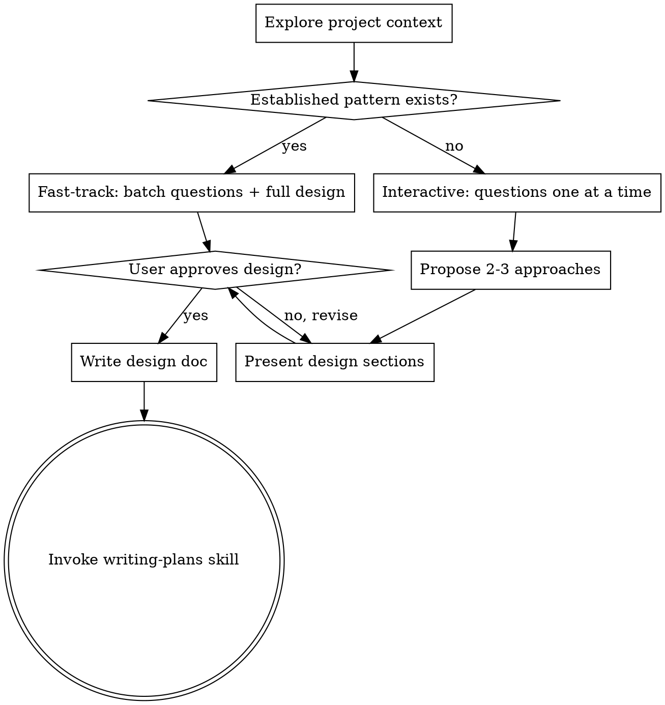

# Brainstorming Ideas Into Designs

## Overview

Help turn ideas into fully formed designs and specs through natural collaborative dialogue.

Start by understanding the current project context, then determine if this is a **fast-track** or **interactive** brainstorm. Present the design and get user approval before any implementation.

<HARD-GATE>
Do NOT invoke any implementation skill, write any code, scaffold any project, or take any implementation action until you have presented a design and the user has approved it. This applies to EVERY project regardless of perceived simplicity.
</HARD-GATE>

## Fast-Track vs Interactive Mode

**Before asking any questions, determine the mode:**

Check the project for established patterns — prior spikes, similar features already built, repeated architectural patterns, or clear precedent in the codebase.

**Fast-track mode** activates when:
- The project has prior work following the same pattern (e.g., spike/check crates, API endpoints, UI components that follow an established convention)
- The user's request clearly maps to an existing pattern with minor variations
- The design decisions are straightforward given the established architecture

**Interactive mode** is the fallback when:
- This is genuinely novel work with no clear precedent
- Multiple valid architectures exist and trade-offs are non-obvious
- The user's intent is ambiguous

### Fast-Track Process

1. **Explore project context** silently (use subagents, don't narrate)
2. **Batch all questions** into a single message — present what you've learned, state your assumptions, list any remaining questions together
3. **Present the full design** in one pass (not section-by-section) with your recommended approach and alternatives noted briefly
4. **Wait for single approval** — user says yes, or points out what to change
5. **Write design doc** and transition to writing-plans

### Interactive Process

Use this only when fast-track doesn't apply:

1. **Explore project context** — check files, docs, recent commits
2. **Ask clarifying questions** — one at a time, understand purpose/constraints/success criteria
3. **Propose 2-3 approaches** — with trade-offs and your recommendation
4. **Present design** — in sections scaled to their complexity, get user approval after each section
5. **Write design doc** — save to `docs/plans/YYYY-MM-DD-<topic>-design.md` and commit
6. **Transition to implementation** — invoke writing-plans skill to create implementation plan

## Process Flow

**The terminal state is invoking writing-plans.** Do NOT invoke frontend-design, mcp-builder, or any other implementation skill. The ONLY skill you invoke after brainstorming is writing-plans.

## The Process (Interactive Mode Details)

**Understanding the idea:**
- Check out the current project state first (files, docs, recent commits)
- Ask questions one at a time to refine the idea
- Prefer multiple choice questions when possible, but open-ended is fine too
- Only one question per message - if a topic needs more exploration, break it into multiple questions
- Focus on understanding: purpose, constraints, success criteria

**Exploring approaches:**
- Propose 2-3 different approaches with trade-offs
- Present options conversationally with your recommendation and reasoning
- Lead with your recommended option and explain why

**Presenting the design:**
- Once you believe you understand what you're building, present the design
- Scale each section to its complexity: a few sentences if straightforward, up to 200-300 words if nuanced
- Ask after each section whether it looks right so far
- Cover: architecture, components, data flow, error handling, testing
- Be ready to go back and clarify if something doesn't make sense

## Risk/Spike Coverage

When addressing a risk via spike or prototype, always cover all aspects of the risk in depth. Don't narrow scope to "just the core" — cover every scenario the risk describes. Comprehensive coverage prevents revisiting the same risk later.

## After the Design

**Documentation:**
- Write the validated design to `docs/plans/YYYY-MM-DD-<topic>-design.md`
- Use elements-of-style:writing-clearly-and-concisely skill if available
- Commit the design document to git

**Implementation:**
- Invoke the writing-plans skill to create a detailed implementation plan
- Do NOT invoke any other skill. writing-plans is the next step.

## Key Principles

- **Fast-track when patterns exist** - Don't ask 10 questions when the answer is obvious from prior work
- **YAGNI ruthlessly** - Remove unnecessary features from all designs
- **Explore alternatives** - Always note 2-3 approaches, even in fast-track (just be brief)
- **Be flexible** - Go back and clarify when something doesn't make sense
