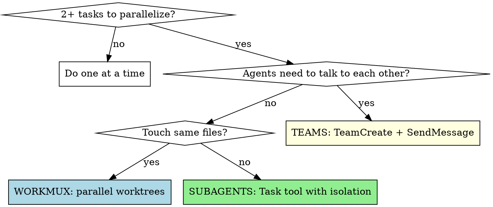
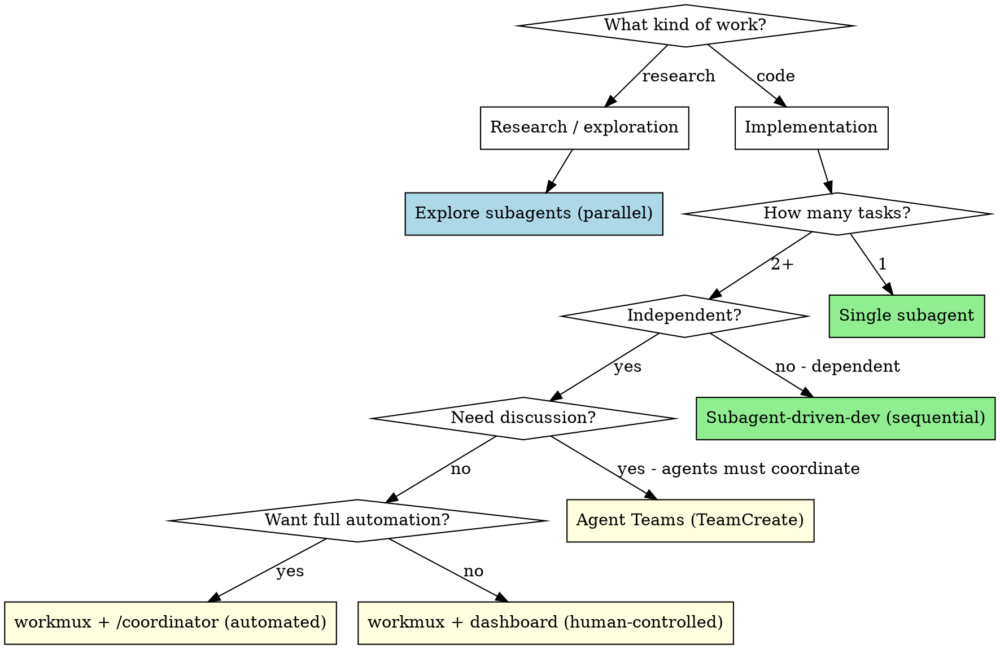

# Orchestrating Agent Teams

## Overview

Three ways to parallelize work in Claude Code. Pick the right one based on whether agents need to communicate and whether they touch the same files.

**Core principle:** Match the coordination overhead to the task. Don't use teams when subagents suffice. Don't use subagents when workmux gives you more control.

## When to Use



## Three Patterns

| | Subagents | Agent Teams | workmux |
|---|---|---|---|
| **How** | `Task` tool calls | `TeamCreate` + `SendMessage` | `workmux add` + tmux panes |
| **Communication** | Results return to parent only | Agents message each other | `/coordinator` or human via dashboard |
| **Isolation** | `isolation: "worktree"` optional | Each agent has own context | Each agent has own git worktree |
| **Token cost** | 1x per agent (results summarized) | 3-4x (each agent = full session) | 1x per pane (independent sessions) |
| **Best for** | Focused tasks, result is all that matters | Complex work needing discussion | Maximum control, independent features |
| **Coordination** | Parent manages everything | Shared task list, self-coordination | Human via dashboard, or agent via `/coordinator` |
| **File conflicts** | Possible without worktree isolation | Possible (same repo) | Impossible (separate worktrees) |

## Pattern 1: Subagents (Task Tool)

**When:** Focused tasks where only the result matters. No inter-agent communication needed.

```
# Parallel research — multiple Explore agents
Task(subagent_type="Explore", prompt="Find all uses of FsrsParams")
Task(subagent_type="Explore", prompt="Find all migration patterns")

# Parallel implementation — worktree-isolated agents
Task(subagent_type="general-purpose", isolation="worktree",
     prompt="Implement R14 stats aggregation spike...")
Task(subagent_type="general-purpose", isolation="worktree",
     prompt="Implement R15 search enrichment spike...")

# Parallel review — specialized reviewers
Task(subagent_type="feature-dev:code-reviewer", prompt="Review auth module...")
Task(subagent_type="feature-dev:code-reviewer", prompt="Review search module...")
```

**Key options:**
- `isolation: "worktree"` — agent gets its own git worktree (prevents file conflicts)
- `model: "sonnet"` — use Sonnet for cost-sensitive tasks
- `run_in_background: true` — don't block; get notified on completion
- `mode: "bypassPermissions"` — no confirmation prompts

### Custom Agent Definitions

Define reusable agents in `.claude/agents/` (project) or `~/.claude/agents/` (user):

```markdown
---
name: spike-implementer
description: Implements risk spike crates with TDD
tools: Read, Write, Edit, Bash, Glob, Grep
model: sonnet
isolation: worktree
---

You implement standalone Rust spike crates following TDD.
Given a task spec, you:
1. Create the crate structure
2. Write failing tests first
3. Implement minimal code to pass
4. Run `cargo test` to verify
5. Commit with descriptive message

Follow the project's spike pattern: spike/{name}/Cargo.toml, src/, tests/
```

Dispatch with: `Task(subagent_type="spike-implementer", prompt="...")`

## Pattern 2: Agent Teams (TeamCreate)

**When:** Agents need to share findings, coordinate on dependencies, or build on each other's work.

**Requires:** `CLAUDE_CODE_EXPERIMENTAL_AGENT_TEAMS=1` in settings.json env.

```
# 1. Create team
TeamCreate(team_name="r11-r15-spikes")

# 2. Create shared tasks
TaskCreate(subject="R11: Adaptive rating algorithm")
TaskCreate(subject="R14: Stats aggregation")
TaskCreate(subject="R15: Search enrichment")

# 3. Spawn teammates
Task(team_name="r11-r15-spikes", name="rating-agent",
     subagent_type="general-purpose",
     prompt="You are the rating algorithm specialist...")
Task(team_name="r11-r15-spikes", name="stats-agent",
     subagent_type="general-purpose",
     prompt="You are the stats aggregation specialist...")

# 4. Teammates self-claim tasks from shared TaskList
# 5. Teammates communicate via SendMessage
# 6. Lead synthesizes results
# 7. Shutdown teammates, TeamDelete
```

**Team sizing:** 3-5 teammates is the sweet spot. Three focused agents outperform five scattered ones.

**Model optimization:** Run lead on Opus, teammates on Sonnet.

**Require plan approval** for risky tasks: spawn with `mode: "plan"` so lead reviews approach before implementation.

## Pattern 3: workmux (Parallel Worktrees + tmux)

**When:** Maximum control. Each agent is an independent Claude session in its own worktree and tmux pane. Orchestrate via dashboard, or let a coordinator agent manage the full lifecycle.

**Prerequisites:** `workmux` installed (`cargo install workmux`), running inside tmux.

### Agent Integration

workmux auto-detects `claude` in pane commands and injects prompts natively. No special config needed — just provide a prompt:

```bash
# Create worktree + launch Claude with inline prompt
workmux add feature/auth -p "Implement user authentication with OAuth"

# From a prompt file (great for detailed specs)
workmux add feature/refactor -P task-spec.md

# Auto-generate branch name from prompt (requires `llm` CLI)
workmux add -A -p "Fix race condition in payment handler"

# Background launch — don't switch to the pane
workmux add feature/caching -b -p "Add caching layer for API responses"

# Multi-agent: spawn 2 instances of same task
workmux add my-feature -n 2 -p "Implement task #{{ num }} in TASKS.md"
```

### .workmux.yaml Configuration

```yaml
# Project-level config
agent: claude  # Default agent for <agent> placeholder

post_create:
  - cargo build

files:
  copy:
    - .env
  symlink:
    - target  # Share build cache across worktrees

panes:
  - command: <agent>   # Resolves to `claude`; auto-receives prompt
    focus: true
  - split: horizontal  # Shell pane for manual commands
```

Custom Claude flags work in pane commands — workmux auto-detects `claude` regardless of flags:

```yaml
panes:
  - command: "claude --dangerously-skip-permissions"
    focus: true
  - split: horizontal
```

### Three Orchestration Modes

#### A. Human-orchestrated (dashboard)

You monitor agents and intervene manually:

```bash
# Spawn agents
workmux add r11-rating -p "Implement adaptive rating spike"
workmux add r14-stats -p "Implement stats aggregation spike"

# Monitor all agents in TUI dashboard
workmux dashboard

# Send instructions to a running agent
workmux send r11-rating "Use percentile-based thresholds, not hardcoded cutoffs"

# When done, merge one at a time
workmux merge r11-rating
workmux merge r14-stats
```

Dashboard shows: project, agent name, git diff stats, status (working/waiting/done), time since last change, and session title. Press `d` for diff view, `c` to send commit, `m` to send merge.

#### B. Agent-delegated (/worktree skill)

From within a Claude session, delegate tasks to parallel worktrees. Fire and forget.

```
> /worktree Implement the caching layer we discussed
> /worktree Fix the race condition in handler.go
> /worktree Add dark mode, Implement caching  # multiple tasks
```

The main agent writes a prompt file with full context from the conversation and runs `workmux add` to create the worktree. Useful when:
- The agent already understands the task from your conversation
- You want to parallelize work while continuing in the main window
- You're delegating multiple related tasks from a plan

#### C. Fully automated (/coordinator skill)

The coordinator agent manages the entire lifecycle: spawning, monitoring, communicating, and merging. You stay hands-off.

```
> /coordinator Break down the auth refactor into parallel tasks:
  1. Extract session logic into its own module
  2. Add OAuth provider support
  3. Write integration tests for the new auth flow
```

Key commands the coordinator uses:

| Command | Purpose |
|---|---|
| `workmux add -b -P <file>` | Spawn agent in background |
| `workmux status` | Check agent statuses |
| `workmux wait` | Block until agents reach target status |
| `workmux capture` | Read terminal output from an agent |
| `workmux send` | Send instructions or skills to an agent |
| `workmux run` | Run shell commands in an agent's worktree |

Fan-out / fan-in pattern:
1. Write prompt files with full context for each task
2. Spawn all agents in background (`workmux add -b -P prompt.md`)
3. Confirm started: `workmux wait --status working`
4. Wait for completion: `workmux wait`
5. Review results: `workmux capture`
6. Merge sequentially: send `/merge` to each agent

### Lifecycle

```bash
# When agent finishes
workmux merge r11-rating    # Merge branch + cleanup worktree + close pane

# Or discard
workmux remove r14-stats    # Remove without merging
```

### Agent Status Tracking

workmux tracks agent status in tmux window names:
- Working — agent is active
- Waiting — agent needs input (auto-clears on focus)
- Done — agent finished (auto-clears on focus)

Toggle between agents: `workmux last-agent` (like vim's `Ctrl+^`)

### Sandbox

For running agents with `--dangerously-skip-permissions`, workmux supports container/VM sandboxing. Agents get read-write access to their worktree but no access to host secrets (SSH keys, AWS creds, GPG keys). Status tracking, dashboard, and merging all work the same inside the sandbox.

## Prompt Engineering for Agents

Good agent prompts have five parts:

### 1. Role and Context

```markdown
You are implementing the R14 Stats Aggregation spike for Aletheia,
a Rust + SQLite flashcard app. This is iteration 14 of a spiral
development model — all previous risks (R01-R13) are mitigated.
```

### 2. Specific Scope

```markdown
Your task: Create spike/stats-check/ with tests proving that
aggregation queries (deck progress, heatmap, forecast) return
correct results on synthetic data within acceptable latency.
```

### 3. Acceptance Criteria

```markdown
Done when:
- [ ] vw_deck_stats recursive CTE returns correct counts
- [ ] Heatmap groups review_logs by date correctly
- [ ] Forecast predicts daily load from scheduled_days
- [ ] All queries <100ms at 10K+ review_logs
- [ ] cargo test passes
```

### 4. Constraints

```markdown
Constraints:
- Follow TDD: write failing test first, then implement
- Use rusqlite (bundled) — same as other spikes
- Do NOT modify files outside spike/stats-check/
- Commit with message format: feat(R14): description
```

### 5. Expected Output

```markdown
When done, return:
- Summary of what you built and key design decisions
- Test count and all test names
- Any issues or open questions
```

### Prompt Anti-Patterns

| Bad | Good | Why |
|-----|------|-----|
| "Build the stats module" | "Create spike/stats-check/ with these 6 tests..." | Vague scope = agent wanders |
| "Fix it" | "The heatmap query returns wrong counts because..." | No context = wasted investigation |
| No constraints | "Do NOT modify files outside spike/" | Agent may refactor everything |
| "Let me know what you did" | "Return: summary, test count, open questions" | Vague output = useless report |

## Decision Guide



### /worktree vs /coordinator

| | /worktree | /coordinator |
|---|---|---|
| **Style** | Fire and forget | Full lifecycle management |
| **Merging** | You merge manually | Coordinator merges sequentially |
| **Follow-up** | You send follow-ups via dashboard | Coordinator sends follow-ups automatically |
| **Best for** | Delegating tasks you'll review later | Multi-step plans with ordered merging |

## Integration

**Uses:**
- **superpowers:using-git-worktrees** — worktree setup for isolation
- **superpowers:subagent-driven-development** — sequential task execution
- **superpowers:dispatching-parallel-agents** — parallel subagent dispatch

**Used by:**
- **superpowers:writing-plans** — execution handoff after planning
- **superpowers:brainstorming** — when design leads to parallel implementation

## Common Mistakes

**Starting with teams when subagents suffice.** Teams cost 3-4x tokens. If agents don't need to talk, use subagents or workmux.

**Skipping worktree isolation.** Two agents editing the same file = merge conflicts and lost work. Always use `isolation: "worktree"` for implementation subagents.

**Vague prompts.** "Build feature X" fails. Provide: role, scope, acceptance criteria, constraints, expected output.

**Too many teammates.** 3 focused agents > 5 scattered agents. Start small, add if needed.

**Forgetting to merge workmux branches.** Each workmux pane creates a git branch. Use `workmux merge` or `workmux remove` to clean up.

**Using /coordinator for simple delegation.** If you just want to spin off a task and review later, `/worktree` is simpler. Use `/coordinator` only when you need automated lifecycle management (wait, review, follow-up, merge).
